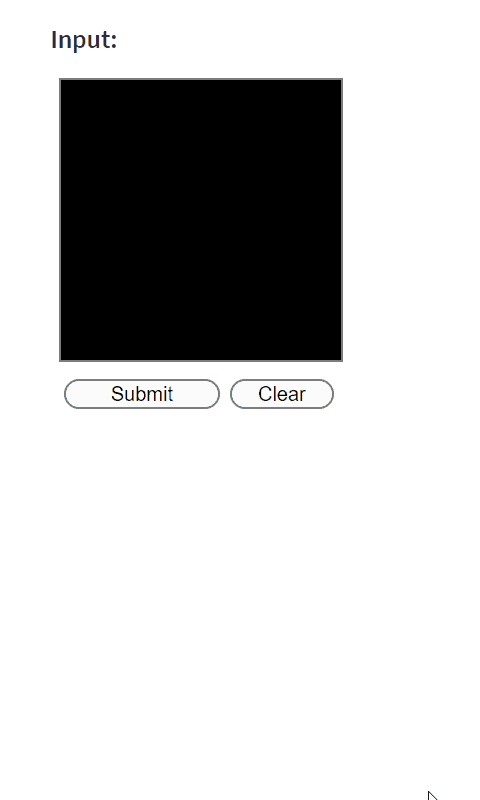

# Streamlit MNIST Canvas

## Overview

This repository provides a Streamlit component, `st_mnist_canvas`, designed for creating and recognizing handwritten digits. It's a perfect tool for educational purposes, machine learning model testing, and demonstrations.

## Installation

To install Streamlit Oekaki, run the following command:

```bash
pip install streamlit-mnist-canvas
```

## Usage

`st_mnist_canvas` enables users to draw digits in a Streamlit app. The digit can then be displayed and processed, making it highly effective for use with MNIST-trained digit recognition models.

### Example
Here's how to get started with st_mnist_canvas:
```python
import streamlit as st
from streamlit_mnist_canvas import st_mnist_canvas
import numpy as np

st.subheader("Input")
result = st_mnist_canvas()

if result.is_submitted:
    st.write("Output")
    st.image(result.resized_grayscale_array, caption="Grayscale 28x28 Image")

    # Prepare the image for ML model prediction
    # image_for_prediction = np.expand_dims(result.resized_grayscale_array, axis=0)

    # Predict digit using a machine learning model
    # Example: prediction = model.predict(image_for_prediction)
    # st.write("Predicted Digit:", prediction)
```

Integrating with Machine Learning Models  
`st_mnist_canvas` can be directly integrated with ML models, especially those trained on the MNIST dataset. Once a digit is drawn and submitted, the image data, formatted as a 28x28 grayscale array, is ready for input into a pre-trained model. This allows for real-time digit recognition and analysis within your Streamlit app.



## License
This project is licensed under the MIT License - see the LICENSE file for details.